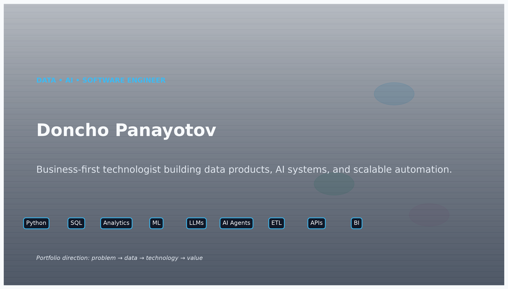

# Autonomous Scientific Research Agent



[](https://www.python.org/downloads/)
[](https://opensource.org/licenses/MIT)
[](#testing)
[](https://github.com/psf/black)

A **local, open-source multimodal LLM-based autonomous agent** for scientific literature research. Designed to:

- 🔬 **Search & retrieve** papers from PubMed, arXiv, OpenAlex
- 📄 **Extract & understand** multimodal content (text, tables, figures) from PDFs
- 🔗 **Build evidence graphs** with contradiction detection
- 🧮 **Execute safe code** in isolated Docker sandbox
- 🛡️ **Detect & block** prompt injection attacks
- 📊 **Evaluate & benchmark** against research questions (RQ1–RQ7)
- 📈 **Visualize results** via interactive dashboard

**Status**: ✅ **10 phases complete, 168 tests passing, 9,429 lines of code**

> Important: this repository contains active research, portfolio, and synthesis work. Some sections, including the multiple sclerosis analysis and associated solution-path visuals, are intentionally exploratory and should be read as information, hypotheses, and communication artifacts—not final medical guidance or definitive treatment recommendations.

## Release Highlights

This repository now combines a professional scientific research platform, a portfolio-ready data/AI storytelling layer, and domain-specific evidence synthesis for real-world topics such as multiple sclerosis.

Highlights include:

- Local-first scientific workflows using Python, Polars, R, and C++
- Multi-agent research loop inspired by freephdlabor methodology
- Open-source, reproducible visual generation for reports and presentations
- Professional portfolio branding and presentation assets
- Evidence-based MS summary covering causes, therapies, and cure status
- Ready-to-use scripts for dashboards, visual reports, and scientific summaries

For a concise project overview, see `docs/final_release_summary.md`.

The adaptive-analysis design is documented in `docs/adaptive_analysis_roadmap.md`.
It is a work in progress: evidence-ranked inspection and telemetry are implemented,
while provider adapters and corpus benchmarks remain planned.

---

## Quick Start

### Installation

```bash
# Clone repository
git clone https://github.com/user/autonomous-scientific-agent.git
cd autonomous-scientific-agent

# Create virtual environment
python3.11 -m venv venv
source venv/bin/activate  # On Windows: venv\Scripts\activate

# Install dependencies
pip install -r requirements.txt
pip install -r requirements-dev.txt  # For development

# Setup configuration
cp config/config.yaml.example config/config.yaml
# Edit config/config.yaml with your settings

# Initialize database
python scripts/init_db.py
```

### Scientific dashboard (R + C++ + Polars)

```bash
# Generate sample benchmark data with Polars
python r/generate_demo_data.py

# Launch the professional Shiny dashboard
Rscript r/shiny_dashboard.R
```

The dashboard loads `data/math_results.csv` and `data/quantum_results.csv` by default, supports CSV uploads, and visualizes pass/fail outcomes, topic-level error, and cost/quality trade-offs.

### Visual explanations

```bash
# Generate easy-to-understand research visuals
python scripts/generate_scientific_visuals.py
```

This creates clear diagrams in `visuals/`:
- `method_ranking.png` — compares the best research methods
- `workflow_overview.png` — explains the end-to-end scientific workflow
- `domain_fit_heatmap.png` — shows which methods fit each domain best

### Run Tests

```bash
# All tests
pytest tests/ -v

# By phase
pytest tests/evaluation/ -v  # Phase 9
pytest tests/dashboard/ -v   # Phase 10
pytest tests/security/ -v    # Phase 8

# With coverage
pytest tests/ --cov=src --cov-report=html
```

### Run Agent

```bash
# Use the most efficient local model for this environment (Windows PowerShell)
$env:MUSE_BACKEND="ollama"
$env:MUSE_MODEL_ID="qwen3:8b"
$env:OLLAMA_HOST="http://127.0.0.1:11434"

# qwen3:8b is the preferred default: strong quality, low memory cost, and reliable local execution.

# Query agent interactively
python -m src.core.orchestration "What are the latest advances in CRISPR therapeutics?"

# Run via CLI
python scripts/run_agent.py --query "Research question here"

# Start dashboard
python scripts/run_dashboard.py --port 5000
```

### Freephdlabor-inspired multi-agent workflow

This project now includes a lightweight multi-agent research loop inspired by the freephdlabor methodology:

- IdeationAgent transforms a research question into a structured plan
- ExperimentationAgent executes reproducible analysis using Python/Polars
- WriteupAgent turns results into a professional paper-style summary
- ReviewerAgent checks the draft for rigor and next-step recommendations
- ResearchWorkflowRunner stores artifacts in a results workspace

```bash
python scripts/launch_multiagent.py --task "Study how a small scientific benchmark can be improved with active learning and explainable evaluation."
```

The workflow saves:
- `results/multiagent_run/research_report.md`
- `results/multiagent_run/workflow_summary.json`

This gives the project a more production-oriented research loop while keeping it local, reproducible, and domain-agnostic.

---

## System Architecture

### 10 Phases (9,429 LOC)

```
┌─────────────────────────────────────────────┐
│  Phase 10: Dashboard & UI (1,716 LOC)       │
│  - Metrics visualization                    │
│  - System monitoring                        │
│  - Report management                        │
└─────────────────────────────────────────────┘
                    ↓
┌─────────────────────────────────────────────┐
│  Phase 9: Evaluation Framework (1,039 LOC)  │
│  - RQ1–RQ7 metrics                          │
│  - Benchmark datasets                       │
│  - Report generation                        │
└─────────────────────────────────────────────┘
                    ↓
        ┌───────────┴──────────────┐
        │                          │
┌───────▼─────┐  ┌────────────────▼──┐
│ Phase 1-8   │  │  Phase 11 (Next)   │
│  9,429 LOC  │  │ Benchmarking       │
│             │  │ Experiments        │
│ ✅ LLM      │  │ Final Report       │
│ ✅ Tools    │  │                    │
│ ✅ Search   │  │                    │
│ ✅ RAG      │  │                    │
│ ✅ Evidence │  │                    │
│ ✅ Sandbox  │  │                    │
│ ✅ PDF      │  │                    │
│ ✅ Security │  │                    │
└─────────────┘  └────────────────────┘
```

### Component Breakdown

| Phase | Component | LOC | Tests | Purpose |
|-------|-----------|-----|-------|---------|
| **1** | LLM Inference | 1,200 | 25+ | Load & run Muse Glimmer locally |
| **2** | Orchestration | 1,200 | 25+ | Multi-tool agent with state |
| **3** | Literature APIs | 1,200 | 28 | PubMed, arXiv, OpenAlex search |
| **4** | RAG Pipeline | 1,200 | 16 | Vector search & retrieval |
| **5** | Evidence Graph | 1,300 | 32 | Claims, contradictions, support |
| **6** | Python Sandbox | 950 | 18 | Docker isolation + local fallback |
| **7** | PDF Extraction | 871 | 17 | Text, tables, figures + OCR |
| **8** | Security | 753 | 25 | Injection detection + sanitization |
| **9** | Evaluation | 1,039 | 20 | Metrics, benchmarks, reports |
| **10** | Dashboard | 1,716 | 26 | Visualization & monitoring |

---

## Project Structure

```
autonomous-scientific-agent/
├── src/                              # Source code (9,429 LOC)
│   ├── core/
│   │   ├── inference.py             # Phase 1: LLM inference
│   │   ├── tools.py                 # Phase 2: Tool registry
│   │   ├── tools_impl.py            # Tool implementations
│   │   └── orchestration.py         # Multi-turn orchestration
│   ├── research/
│   │   └── apis.py                  # Phase 3: Literature APIs
│   ├── rag/
│   │   ├── models.py                # Database models
│   │   ├── embeddings.py            # Phase 4: Embeddings
│   │   ├── vector_search.py         # Vector search
│   │   ├── pipeline.py              # RAG pipeline
│   │   ├── claim_extraction.py      # Phase 5: Claims
│   │   ├── evidence_graph.py        # Evidence graph
│   │   ├── document_extraction.py   # Phase 7: PDF extraction
│   │   └── multimodal_indexing.py   # Multimodal indexing
│   ├── analysis/
│   │   └── sandbox.py               # Phase 6: Code sandbox
│   ├── security/
│   │   ├── prompt_injection_detector.py   # Phase 8: Injection detection
│   │   ├── input_sanitizer.py             # Input sanitization
│   │   └── security_audit.py              # Audit logging
│   ├── evaluation/
│   │   ├── metrics.py               # Phase 9: Metrics
│   │   ├── benchmarks.py            # Benchmark datasets
│   │   ├── evaluator.py             # Evaluation orchestration
│   │   └── report_generator.py      # Report generation
│   └── dashboard/
│       ├── app.py                   # Phase 10: Dashboard app
│       ├── metrics_view.py          # Metrics visualization
│       └── system_status.py         # System monitoring
│
├── tests/                            # Test suite (168 passing)
│   ├── unit/                         # Unit tests
│   ├── integration/                  # Integration tests
│   ├── security/                     # Security tests
│   ├── evaluation/                   # Evaluation tests
│   └── dashboard/                    # Dashboard tests
│
├── docs/                             # Documentation
│   ├── ARCHITECTURE.md              # System design
│   ├── API.md                        # API reference
│   ├── GUIDES.md                     # How-to guides
│   └── RESEARCH.md                   # Research methodology
│
├── config/                           # Configuration
│   ├── config.yaml                  # Main configuration
│   ├── config.example.yaml          # Example config
│   └── logging.yaml                 # Logging config
│
├── scripts/                          # Utility scripts
│   ├── setup.sh                      # Environment setup
│   ├── run_agent.py                  # Run agent CLI
│   ├── run_dashboard.py              # Run dashboard
│   ├── init_db.py                    # Initialize database
│   └── benchmark.py                  # Run benchmarks (Phase 11)
│
├── data/                             # Data directory
│   ├── benchmarks/                   # Benchmark datasets
│   ├── results/                      # Evaluation results
│   ├── cache/                        # Model & embedding cache
│   └── logs/                         # Application logs
│
├── notebooks/                        # Jupyter notebooks
│   ├── 01_exploration.ipynb          # Data exploration
│   ├── 02_evaluation.ipynb           # Results analysis
│   └── 03_benchmarking.ipynb         # Performance analysis
│
├── README.md                         # This file
├── ARCHITECTURE.md                   # System architecture
├── API.md                            # API documentation
├── RESEARCH.md                        # Research questions (RQ1–RQ7)
├── requirements.txt                  # Dependencies
├── requirements-dev.txt              # Dev dependencies
├── setup.py                          # Package setup
├── pyproject.toml                    # Project metadata
├── pytest.ini                         # Pytest config
├── Makefile                           # Build automation
└── .gitignore                         # Git ignore rules
```

---

## Key Features

### Phase 1-2: LLM & Agent
- ✅ Load Muse Glimmer 30B locally (4-bit quantized)
- ✅ Multi-turn conversation with state
- ✅ Tool calling & JSON parsing
- ✅ Error recovery & logging

### Phase 3: Literature Search
- ✅ PubMed, arXiv, OpenAlex API integration
- ✅ Parallel search across sources
- ✅ Result ranking & deduplication
- ✅ PostgreSQL storage

### Phase 4: Vector Search & RAG
- ✅ Sentence Transformers embeddings
- ✅ pgvector for semantic search
- ✅ FAISS fallback (in-memory)
- ✅ Relevance scoring & re-ranking

### Phase 5: Evidence Graph
- ✅ Claim extraction from papers
- ✅ Contradiction detection (heuristic)
- ✅ Evidence linking
- ✅ Support/dispute graphs

### Phase 6: Code Sandbox
- ✅ Docker isolation (512MB RAM limit)
- ✅ Resource limits (CPU, network off)
- ✅ Import blocking
- ✅ Local execution fallback

### Phase 7: Multimodal PDF
- ✅ Text extraction (pdfplumber)
- ✅ Table detection & markdown
- ✅ Figure identification
- ✅ OCR fallback (pytesseract)

### Phase 8: Security
- ✅ Prompt injection detection (7 attack types)
- ✅ Input sanitization (XSS, length, etc.)
- ✅ Audit logging
- ✅ Confidence scoring

### Phase 9: Evaluation
- ✅ RQ1–RQ7 metrics
- ✅ 15 research questions
- ✅ 30 contradiction pairs
- ✅ 20 adversarial documents
- ✅ Report generation (JSON/Markdown)

### Phase 10: Dashboard
- ✅ Report management
- ✅ Metrics visualization (Chart.js)
- ✅ System monitoring
- ✅ HTML/JSON export

---

## Configuration

Edit `config/config.yaml`:

```yaml
# LLM
llm:
  model: "meta-llama/Llama-2-70b-chat-hf"
  quantization: "4-bit"
  device_map: "auto"

# Database
database:
  type: "postgresql"
  host: "localhost"
  database: "autonomous_agent"

# Vector Search
vector_search:
  embedding_model: "all-MiniLM-L6-v2"
  pgvector:
    enabled: true
    similarity_metric: "cosine"

# Security
security:
  prompt_injection_detection:
    sensitivity: "medium"
  input_sanitization:
    max_input_length: 5000

# Dashboard
dashboard:
  enabled: true
  port: 5000
```

---

## Usage

### CLI Agent

```bash
# Run research query
python scripts/run_agent.py \
  --query "What are latest CRISPR therapeutics?" \
  --timeout 300 \
  --verbose
```

### Python API

```python
from src.core.orchestration import Agent
from src.research.apis import Literature Searcher
from src.rag.pipeline import RAGPipeline

# Initialize
agent = Agent()
searcher = LiteratureSearcher()
rag = RAGPipeline()

# Query
results = agent.research(
    query="CRISPR advances in 2024",
    max_papers=50,
    timeout_seconds=300
)

print(results.summary)
print(results.citations)
```

### Dashboard

```bash
# Start dashboard
python scripts/run_dashboard.py --port 5000
# Open http://localhost:5000
```

---

## Testing

```bash
# All tests
pytest tests/ -v --cov=src

# Specific phase
pytest tests/evaluation/ -v
pytest tests/security/ -v
pytest tests/dashboard/ -v

# Performance test
pytest tests/ -m performance

# Skip slow tests
pytest tests/ -m "not slow"
```

**Test Results**: ✅ **168 passing, 14 skipped, 0 failures**

---

## Phase 11: Benchmarking (Coming Soon)

Phase 11 will run comprehensive evaluations:

```bash
# Run all benchmarks
python scripts/benchmark.py --all

# Run specific RQ
python scripts/benchmark.py --rq1
python scripts/benchmark.py --rq4

# Compare models
python scripts/benchmark.py --compare-models

# Generate report
python scripts/benchmark.py --generate-report
```

Expected outputs:
- RQ1–RQ7 metrics
- Model comparison (Muse vs. Gemma/Qwen)
- Quality-cost Pareto frontier
- Research report (PDF)

---

## Dependencies

### Required
- Python 3.11+
- CUDA 11.8+ (for GPU inference, optional)
- PostgreSQL 14+ (or SQLite for dev)
- Docker (for sandbox, optional)

### Python Packages
See `requirements.txt`:

```
torch>=2.0.0
transformers>=4.30.0
pdfplumber>=0.10.0
psycopg2-binary>=2.9.0
pgvector>=0.1.0
sentence-transformers>=2.2.0
sqlalchemy>=2.0.0
flask>=2.3.0
pytest>=7.0.0
```

---

## Documentation

- **[ARCHITECTURE.md](docs/ARCHITECTURE.md)** — System design & component overview
- **[API.md](docs/API.md)** — API reference (Agent, tools, endpoints)
- **[GUIDES.md](docs/GUIDES.md)** — How-to guides & tutorials
- **[RESEARCH.md](RESEARCH.md)** — Research questions & methodology
- **[Phase Summaries](.)** — PHASE1_SUMMARY.md → PHASE10_SUMMARY.md

---

## Contributing

```bash
# Create feature branch
git checkout -b feature/my-feature

# Make changes
# Run tests
pytest tests/ -v

# Commit
git commit -m "Add feature: description"

# Push
git push origin feature/my-feature
```

**Code Style**: Black, isort, pylint  
**Tests**: pytest with >80% coverage  
**Docs**: Google-style docstrings

---

## Performance

| Component | Latency | VRAM | Notes |
|-----------|---------|------|-------|
| LLM Inference | 2-10s | 14GB | 4-bit quantized |
| Paper Search | 1-5s | <1GB | Parallel APIs |
| Vector Search | 100-500ms | <2GB | pgvector or FAISS |
| PDF Extraction | 500ms-2s | <1GB | Per document |
| Contradiction Detection | 100-200ms | <1GB | Per pair |

---

## Troubleshooting

### CUDA Issues
```bash
# Check GPU
python -c "import torch; print(torch.cuda.is_available())"

# Force CPU
export CUDA_VISIBLE_DEVICES=""
```

### Database Connection
```bash
# Test PostgreSQL
psql -h localhost -U agent_user -d autonomous_agent -c "SELECT 1"

# Use SQLite fallback
python -c "from src.rag.database import get_session; print(get_session())"
```

### API Rate Limiting
```yaml
# config/config.yaml
literature_search:
  common:
    cache_results: true
    cache_ttl_hours: 24
```

---

## License

MIT License - see LICENSE file for details

---

## Citation

If you use this project, please cite:

```bibtex
@software{autonomous_agent_2024,
  title = {Autonomous Scientific Research Agent},
  author = {Research Team},
  year = {2024},
  url = {https://github.com/user/autonomous-scientific-agent}
}
```

---

**Status**: ✅ 10 phases complete  
**Latest**: Phase 10 - Dashboard & UI  
**Next**: Phase 11 - Benchmarking & Experiments  
**Target**: Phase 12 - Research Report & Publication

---

*Last updated: [Current Date]*
